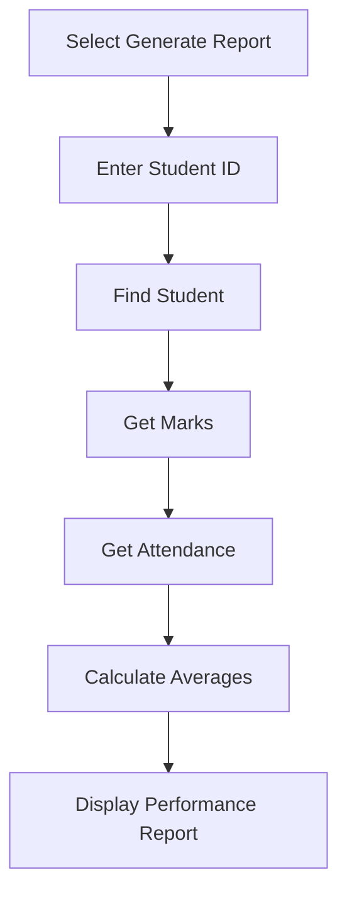

# System Workflow

The application follows a simple workflow from starting the program to performing different operations.

## Main Workflow

- The application starts.
- Existing data is loaded from the text files.
- The main menu is displayed.
- The user selects an operation.
- The selected service performs the required operation.
- The result is displayed to the user.
- The user can continue with another operation.
- The application ends when the user selects Exit.

## Report Workflow

- The user selects Generate Student Report.
- The user enters a student ID.
- The system finds the student.
- Marks and attendance records are retrieved.
- Average marks and attendance are calculated.
- The final report is displayed.


## Workflow Diagram

```mermaid
flowchart TD
    A[Start Application] --> B[Load Existing Data]
    B --> C[Display Main Menu]
    C --> D{Select Operation}

    D -->|Student Management| E[Student Service]
    D -->|Marks Management| F[Marks Service]
    D -->|Attendance Management| G[Attendance Service]
    D -->|Generate Report| H[Report Service]
    D -->|Save Data| I[File Utility]
    D -->|Exit| J[End]

    E --> K[Display Result]
    F --> K
    G --> K
    H --> K
    I --> K

    K --> C
